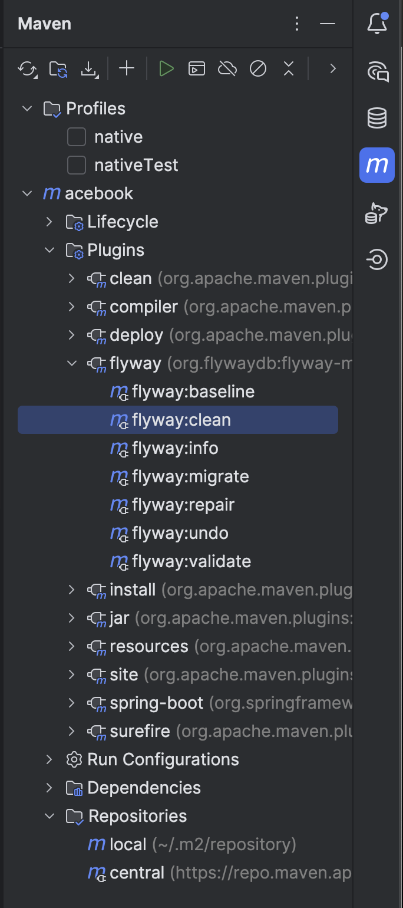

# Add *friend requests* sample data to the database

`V12__animal_friend_requests.sql` adds functionality to the `friend_requests` table, but no sample data. The queries
here can be selectively added to that migration to allow us to work on the relevant views. It is envisaged that
you copy and paste **one or the other** of the below queries to `V12`, it doesn't make sense to use both. Obviously
you'll need to drop the database for this to work, so I've added `flyway-clean` to the dependencies (see below). 

## Requests, but no responses yet

Three friend requests sent by *Fox* to other users, plus one request sent by *Raven*. At this point no responses have
been sent.

```sql

-- | id  | from_user_id | to_user_id | request_msg                                                          | response_msg                                   | status
-- | --- | ------------ | ---------- | -------------------------------------------------------------------- | ---------------------------------------------- |--------
-- | 2   | 7 (fox)      | 8 (wolf)   | Fancy a hunting trip sometime?                                       | null                                           | PENDING
-- | 3   | 7 (fox)      | 12 (hen)   | Can you ever forgive me? 🤣                                          | null                                           | PENDING
-- | 4   | 7 (fox)      | 9 (dog)    | You look familiar - wanna be mates?                                  | null                                           | PENDING
-- | 5   | 13 (raven)   | 7 (fox)    | The scraps are much appreciated - let's keep in touch more regularly | null                                           | PENDING

INSERT INTO friend_requests(from_user_id, to_user_id,  request_message, request_timestamp, response_message, response_timestamp, status) VALUES
 (7, 8, 'Fancy a hunting trip sometime?', '2025-06-03 08:15:00', NULL, NULL, 'PENDING'),
 (7, 12, 'Can you ever forgive me? 🤣', '2025-05-19 10:30:00', NULL, NULL, 'PENDING'),
 (7, 9, 'You look familiar - wanna be mates?', '2025-05-29 14:45:00', NULL, NULL, 'PENDING'),
 (13, 7, E'The scraps are much appreciated - let\'s keep in touch more regularly', '2025-06-1 21:00:00', NULL, NULL, 'PENDING');
```

## Requests and responses

*Fox* gets two responses - an accept and a reject. He still has one outstanding request, as does *Raven*

```sql


-- | id  | from_user_id | to_user_id | request_msg                                                          | response_msg                                   | status
-- | --- | ------------ | ---------- | -------------------------------------------------------------------- | ---------------------------------------------- |----------
-- | 2   | 7 (fox)      | 8 (wolf)   | Fancy a hunting trip sometime?                                       | null                                           | PENDING
-- | 3   | 7 (fox)      | 12 (hen)   | Can you ever forgive me? 🤣                                          | Friends ⁉️ After what you did ⁉️               | REJECTED
-- | 4   | 7 (fox)      | 9 (dog)    | You look familiar - wanna be mates?                                  | Of course I'll be your friend - let's meet up. | ACCEPTED
-- | 5   | 13 (raven)   | 7 (fox)    | The scraps are much appreciated - let's keep in touch more regularly | null                                           | PENDING

INSERT INTO friend_requests(from_user_id, to_user_id,  request_message, request_timestamp, response_message, response_timestamp, status) VALUES
(7, 8, 'Fancy a hunting trip sometime?', '2025-06-03 08:15:00', NULL, NULL, 'PENDING'),
(7, 12, 'Can you ever forgive me? 🤣', '2025-05-19 10:30:00', 'Friends!?️ After what you did!?', '2025-05-21 22:15:00', 'REJECTED'),
(7, 9, 'You look familiar - wanna be mates?', '2025-05-29 14:45:00', 'Of course I''ll be your friend - let''s meet up.', '2025-06-5 9:00:00', 'ACCEPTED'),
(13, 7, E'The scraps are much appreciated - let\'s keep in touch more regularly', '2025-06-1 21:00:00', NULL, NULL, 'PENDING');
```

## Logging in as an animal

I've created the following AuthO accounts to our app, so you can log in as an animal.

| id  | Name         | Username      | AuthO password |
| --- | ------------ | ------------- | -------------- |
| 7   | Roger Fox    | fox@ex.com    | 12345aA!       |
| 8   | Tobias Wolf  | wolf@ex.com   | 12345aA!       |
| 9   | Amelia Dog   | dog@ex.com    | 12345aA!       |
| 10  | Boris Bear   | bear@ex.com   | 12345aA!       |
| 11  | Shona Salmon | salmon@ex.com | 12345aA!       |
| 12  | Hannah Hen   | hen@ex.com    | 12345aA!       |
| 13  | Rita Raven   | raven@ex.com  | 12345aA!       |


## `flyway:clean`
I've added a plugin to the Maven Tool Window called `flyway:clean` which makes dropping the database straightforward (you can see it in `pom.xml`).

Bear in mind the following:
- Of course, you'd be mad to use this command on a production database, but we don't have a production database.
- You can run it on an ad-hoc basis, by right clicking and selecting *Run Maven Build*, or you can run it before every build by right clicking and selecting *Execute Before Build'.
- If you get errors about duplicate version, delete the *target* folder. This will get rebuilt the next time you run build.



